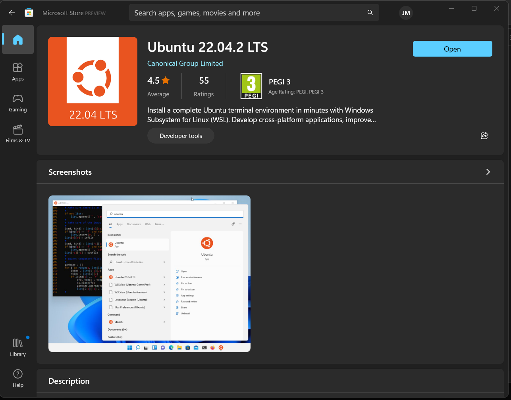
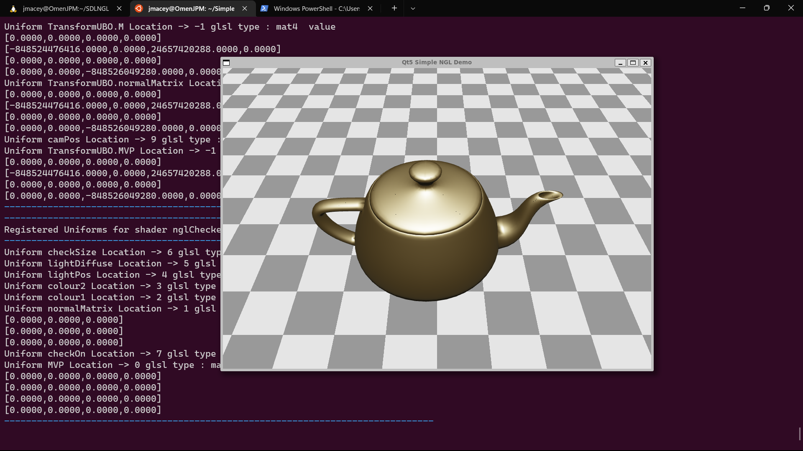
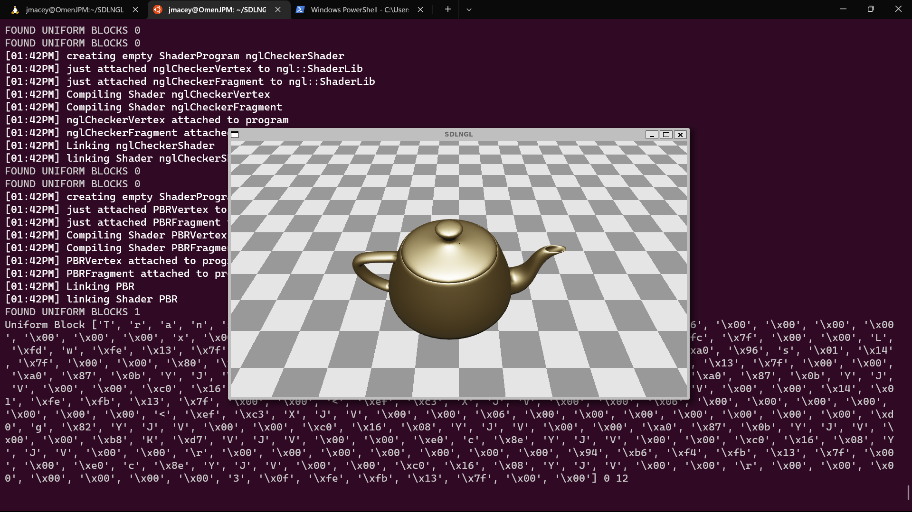

# Installing NGL under WSL

WSL is the Windows Subsystem for Linux, it allows you to run a Linux environment under Windows 10 / 11. It will allow you to run the NGL demos in a very similar way to the lab environment. This can somethings be easier than setting up under native windows. 

Whilst there are a number of linux distributions available for WSL I have only tested with Ubuntu 22.04.2 LTS as this has the simplest out of the box installation for GPU and other tools. I strongly recommend you use this version.

You will also need the correct drivers (I test with nVidia game drivers which support accelerated GPU under wsl)

## Installing WSL

First follow the steps to install WSLg or go to the app store and install the Ubuntu 22.04.2 LTS app. More details can be found here https://learn.microsoft.com/en-us/windows/wsl/tutorials/gui-apps 




Once the initial setup has been done (adding a user and password), we need to install some base packages in the terminal. It is also suggested that VSCode is installed in Windows and the Remote WSL extension is installed. This will allow you to edit and run code in the WSL environment. 

```bash
suso apt-get update
sudo apt install -y build-essential wget vim cmake ninja-build 
sudo apt install -y libgl-dev libxrandr-dev libxinerama-dev libxcursor-dev libxi-dev 
sudo apt install -y git curl  zip unzip tar pkg-config python3 pip
sudo apt install libxinerama-dev libxcursor-dev xorg-dev libglu1-mesa-dev pkg-config
sudo apt install mesa-utils freeglut3-dev mesa-common-dev
sudo apt install libqt6opengl6-dev
```

This will install all of the base packages needed to build NGL and run the demos.

## Installing vcpkg

The vcpkg install is the same as usual, to start with we will only install the core libraries we need to run the NGL demos, you may also need to install other packages later.

```bash
git clone https://github.com/Microsoft/vcpkg.git ~/vcpkg 
cd ~/vcpkg 
./bootstrap-vcpkg.sh 
./vcpkg install install gtest glm gl3w glfw3 rapidjson rapidxml fmt freetype openimageio
```

This may take some time to build, grab a coffee and come back later.

## Installing NGL

We can clone the NGL repository usually you will only need the head of the repo not the full history so we can use the `--depth 1` flag to only get the latest version.

```bash
git clone --depth 1 https://github.com:/NCCA/NGL ~/NGLBuild 
cd ~/NGLBuild/ 
cmake -DCMAKE_TOOLCHAIN_FILE=~/vcpkg/scripts/buildsystems/vcpkg.cmake -DCMAKE_INSTALL_PREFIX=~/NGL -G Ninja -B build -S . 
cd build 
cmake --build .
./NGLTests 
```

This should build all the NGL library and Unit tests, if you get any errors please check the output and make sure you have installed all the packages above.

We can now install NGL using 

```bash
cmake --build . --target install
```

## SimpleNGL demo

We can now build the SimpleNGL demo, this is a simple demo that shows how to use NGL to draw a simple teapot.

```
git clone https://github.com:/NCCA/SimpleNGL 
cd SimpleNGL/
mkdir build
cd build/
cmake -DCMAKE_TOOLCHAIN_FILE=~/vcpkg/scripts/buildsystems/vcpkg.cmake -G Ninja -DCMAKE_PREFIX_PATH=~/NGL  ..
cmake --build .
./SimpleNGL
```




## SDLNGL

The SDLNGL demo requires the SDL2 libraries to be installed, you can do this with vcpkg
```bash
cd ~/vcpkg
./vcpkg install sdl2 sdl2-image
```

Now we can clone and build the demo

```
git clone https://github.com:/NCCA/SDLNGL ~/SDLNGL
cd ~/SDLNGL/
mkdir build
cd build/
cmake -DCMAKE_TOOLCHAIN_FILE=~/vcpkg/scripts/buildsystems/vcpkg.cmake -G Ninja ..
cmake --build .
./SDLNGL
```

#

## Environment variables

To make life easier we can add the following environment variables into our .bashrc file, this will allow us to run the demos without having to set the LD_LIBRARY_PATH and other variables each time.

```bash
export CMAKE_PREFIX_PATH=$CMAKE_PREFIX_PATH:~/NGL
export CMAKE_TOOLCHAIN_FILE=~/vcpkg/scripts/buildsystems/vcpkg.cmake
```

once this is added (you should be able to type code ~/.bashrc if VSCode is installed) you can reload the file with `source ~/.bashrc` and then build the demos without having to set the environment variables each time.

