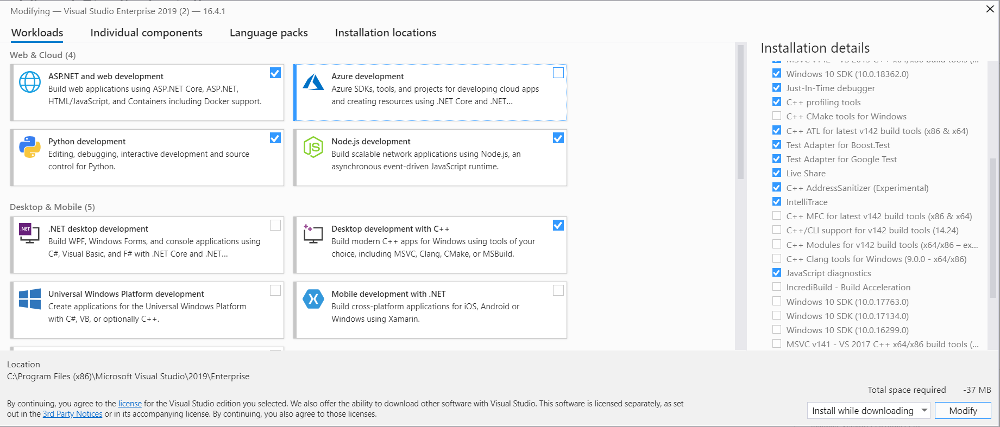
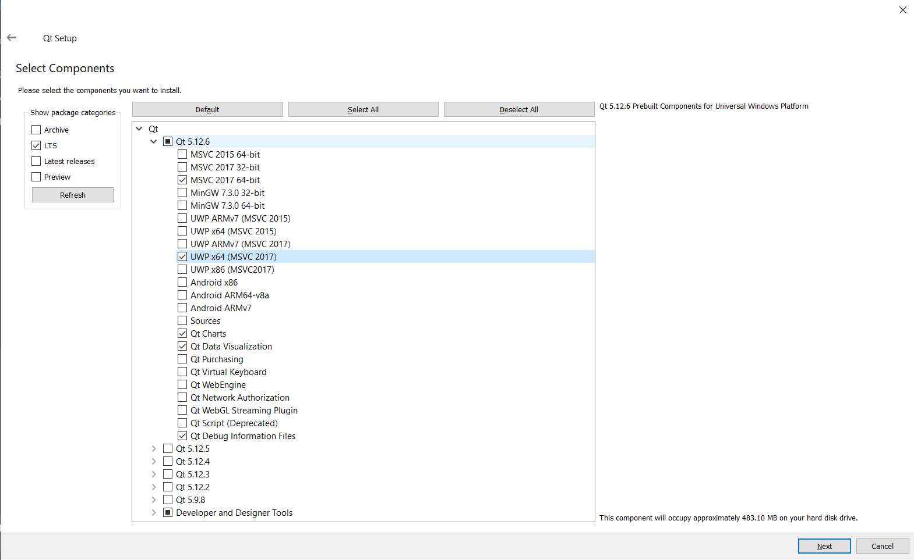

## Windows Build for NGL

The following instructions will help you install and use NGL under windows.

## Pre-requisites

You will need to install Visual Studio community edition from [here](https://visualstudio.microsoft.com/downloads/) NGL will work with any C++ 14 compiler but I have been using MSVC 2019 for the current windows 10 build.

As a minimum choose Desktop C++ development as show in the image here


## install vcpkg

vcpkg is a tool which allows you to install libraries under windows. I use this to help install the required libraries for NGL. Follow the install instructions here  [https://github.com/microsoft/vcpkg](https://github.com/microsoft/vcpkg). It is important to install this in the root of your home directory to ensure this is correct run the cmd.exe terminal and type ```cd %HOMEDRIVE%%HOMEPATH%``` before running the commands to install vcpkg. NGL will use ``` %HOMEDRIVE%%HOMEPATH% ``` in all the build scripts to ensure things are in the correct locations.

Once vcpkg is installed the following libraries need to be added.


```
cd vcpkg
.\vcpkg install gtest
.\vcpkg install glm
.\vcpkg install glfw3
```

## Install Qt 

Qt and Qt Creator can be downloaded from [here](https://www.qt.io/download) choose the Open Source version, you will also need to create an account to get access to the software, this does however allow you access to the forums which are very good.

As a minimum install the latest version of Qt for the MSVC 64 bit compiler as shown in the image below




