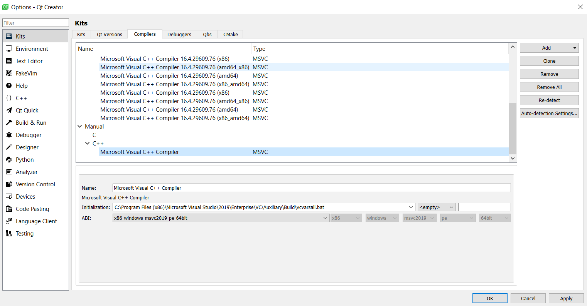
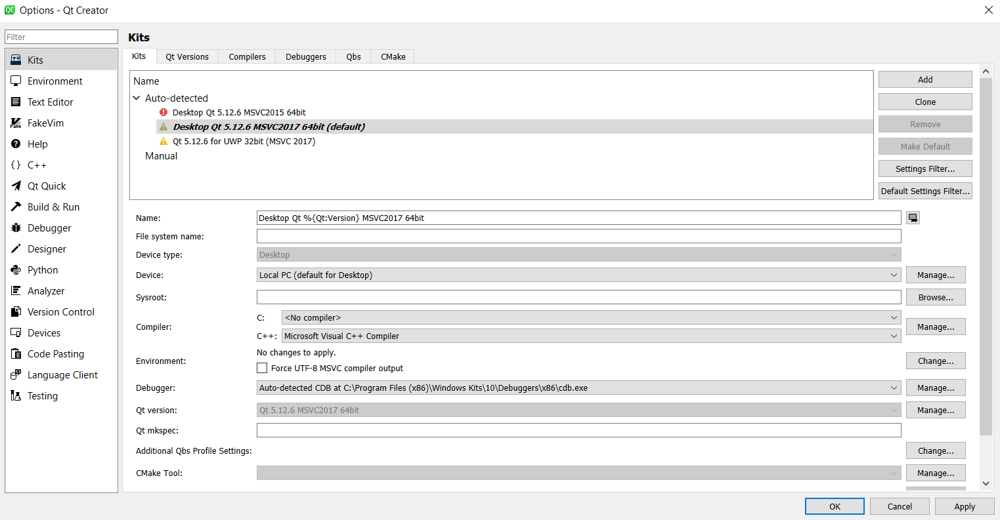
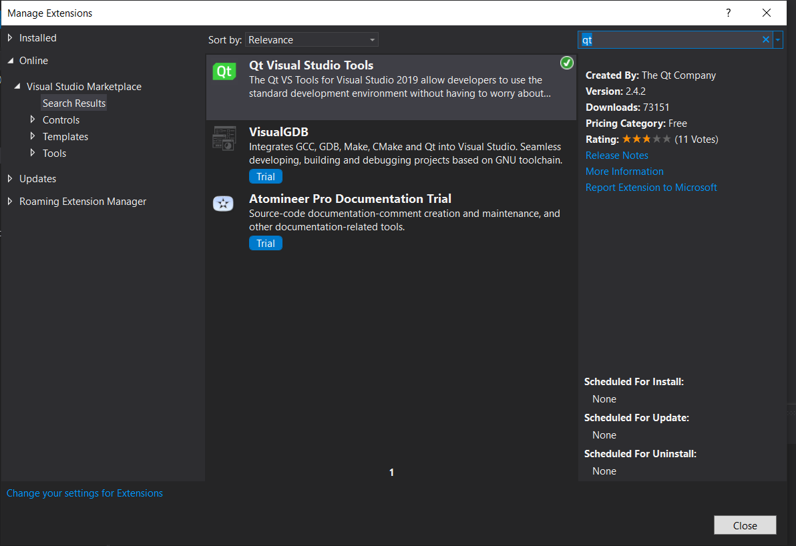

## Windows Build for NGL

The following instructions will help you install and use NGL under windows.

## Pre-requisites

You will need to install Visual Studio community edition from [here](https://visualstudio.microsoft.com/downloads/) NGL will work with any C++ 14 compiler but I have been using MSVC 2019 for the current windows 10 build.

As a minimum choose Desktop C++ development as show in the image here


## Install vcpkg

vcpkg is a tool which allows you to install libraries under windows. I use this to help install the required libraries for NGL. Follow the install instructions here  [https://github.com/microsoft/vcpkg](https://github.com/microsoft/vcpkg). It is important to install this in the root of your home directory to ensure this is correct run the cmd.exe terminal and type ```cd %HOMEDRIVE%%HOMEPATH%``` before running the commands to install vcpkg. NGL will use ``` %HOMEDRIVE%%HOMEPATH% ``` in all the build scripts to ensure things are in the correct locations.

Once vcpkg is installed the following libraries need to be added.


```
cd vcpkg
.\vcpkg install gtest:x64-windows
.\vcpkg install glm:x64-windows
.\vcpkg install glfw3:x64-windows
.\vcpkg install openimageio:x64-windows
.\vcpkg install rapidjson:x64-windows
.\vcpkg install rapidxml:x64-windows
.\vcpkg install fmt:x64-windows

```

## Install Qt 

Qt and Qt Creator can be downloaded from [here](https://www.qt.io/download) choose the Open Source version, you will also need to create an account to get access to the software, this does however allow you access to the forums which are very good.

As a minimum install the latest version of Qt for the MSVC 64 bit compiler as shown in the image below


Once Qt is installed launch Qt Creator and setup the kits / compilers.

1. Choose Tools-> Options -> Kits
2. Choose the Compilers Tab
3. Select Add and choose the MSVC Tab, now select the 64 bit ABI version as shown in the Image below.



Finally in the kits tab select the new compiler as the default compiler for the Kit as shown below.



## Build NGL

NGL can now be cloned and installed as with Mac and Linux. It is important that when building the demos they are build as release or debug for everything. For example NGL build as debug must have the demo programs build as debug as well. Also this will require the correct version of the vcpkg libs to be installed as well for both debug and release.


## Visual Studio build.

It is generally easier to install and use the Visual Studio IDE rather than Qt, however you first need to install the Qt Extensions, from the Extensions menu search for Qt and install the Qt Visual Studio Tools as shown in the image below
 and re-start Visual Studio.

You can now Open Qt Project file from the Extensions -> Qt VS Tools menu and load the NGL project.

Again you will need to setup either Release or Debug builds for all projects and choose the x64 options.

