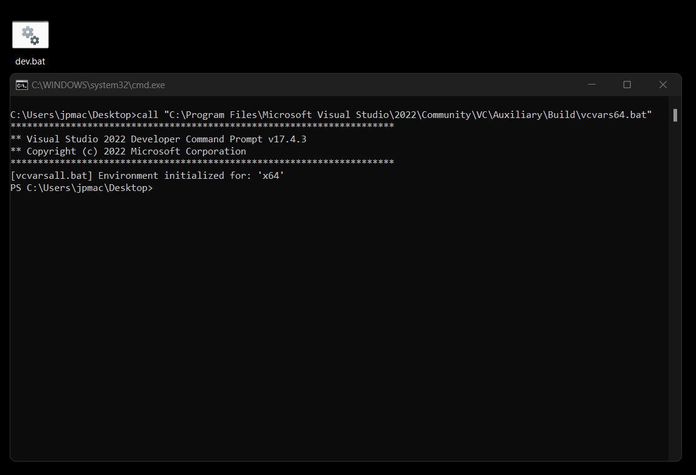

# NGL Install Windows

First we are going to install Visual Studio and set it up. We can download the installer from here https://visualstudio.microsoft.com/free-developer-offers/ and we want the community version.

Once the installer has downloaded run it and choose the workloads tab and choose C++ as shown below


Next scroll down and select the Games development section and select this 

 

Now we can add some extra elements to make life easier. First we will add git as shown


Once these have all been selected we can do an install, this is about 9Gb so will take some time.

## Setting up the development environment

When developing for windows we need to ensure we use the correct platform architecture and build target. This means everything we do should be build for x64 (or x64_86) and if we are building for Debug we need to ensure all libraries are also built for Debug, if for Release everything must be built for Release. 

To make things easier to build all the tools I generate a batch file to run the correct setup scripts from the Visual Studio install then run powershell.

First we will create an empty file on the desktop called dev.bat this can be done by right clicking on the desktop and create new Text Document. Open this file in a text editor (VSCode) and add the following.

```
call "C:\Program Files\Microsoft Visual Studio\2022\Community\VC\Auxiliary\Build\vcvars64.bat"
powershell.exe /NoLogo
```

Once this is saved it should be able to be double clicked and run which should result in a window like this



We should now be able to execute all the commands we need to build NGL 

```
git --version
> git version 2.38.1.windows.1  

cmake --version
> cmake version 3.24202208181-MSVC_2
CMake suite maintained and supported by Kitware (kitware.com/cmake).  

cl
Microsoft (R) C/C++ Optimizing Compiler Version 19.34.31937 for x64
Copyright (C) Microsoft Corporation.  All rights reserved.

usage: cl [ option... ] filename... [ /link linkoption... ]  
```

## Installing vcpkg 

We now need to install vcpkg following the instructions here https://vcpkg.io/en/getting-started.html

```
git clone https://github.com/Microsoft/vcpkg.git
cd vcpkg
bootstrap-vcpkg.bat
```

Now we can install all the requirements for NGL, note the first install will always download extra tools that vcpkg needs so can take some time.

```
.\vcpkg.exe install gtest:x64-windows
.\vcpkg.exe install glm:x64-windows
.\vcpkg.exe install glfw3:x64-windows
.\vcpkg.exe install gl3w:x64-windows
.\vcpkg.exe install rapidjson:x64-windows
.\vcpkg.exe install rapidxml:x64-windows
.\vcpkg.exe install fmt:x64-windows
.\vcpkg.exe install freetype:x64-windows
```

If you wish to build using OpenImageIO rather than the build in simple image loaders you will also need to install OpenImageIO, this can take time and can be problematic so I don't usually use this. 

```
.\vcpkg.exe install openimageio:x64-windows
```

## Install NGL

We can now download NGL and install it I suggest setting up git to work via ssh by following the instructions here https://docs.github.com/en/authentication/connecting-to-github-with-ssh 

```
git clone --depth=1 https://github.com/NCCA/NGL $HOME\NGLBuild
cd NGLBuild
mkdir build
```

We need to set some paths before building so cmake can find vcpkg install location

```
cmake  -DCMAKE_TOOLCHAIN_FILE="$HOME/vcpkg/scripts/buildsystems/vcpkg.cmake" -DCMAKE_INSTALL_PREFIX:PATH="$HOME/NGL"  -DCMAKE_BUILD_TYPE=Debug  ..
cmake --build .
```

As we have selected the target Debug the library and NGLTests.exe will be placed in the new folder called Debug we can change to this folder and run the tests.

```
cd Debug
./NGLTests.exe
```

No we need to install NGL to the correct folder, this is done in the build folder as follows

```
cmake --build . --target install
```

This should now copy all of the files we need to build the demos into $HOME/NGL and should look like this.

```
 ls ~/NGL
Directory: C:\Users\jpmac\NGL

Mode                 LastWriteTime         Length Name
----                 -------------         ------ ----
d-----        14/12/2022     16:18                include
d-----        14/12/2022     16:18                lib
-a----        14/12/2022     15:56           2547 NGLConfig.cmake
```

## Installing Qt

Most of the NGL Demos use Qt, we can use either Qt 5.15.x (which is the vfx-reference platform version) or Qt 6.x which is newer and may not be usable for all platforms. We can get the Qt installer from here https://www.qt.io/download-open-source you will need an account for the forums but this can be useful.

Qt can get quite large, and we don't need to install all components, so we can choose custom install.


For this install I have selected the following, choosing only the latest Visual Studio version for X64 and not of the other platforms.


## SimpleNGL

We should now be able to download an NGL demo and test.

```
git clone https://github.com/NCCA/SimpleNGL 
cd SimpleNGL
mkdir build
cmake  -DCMAKE_TOOLCHAIN_FILE="$HOME/vcpkg/scripts/buildsystems/vcpkg.cmake" -DCMAKE_PREFIX_PATH="$HOME/NGL" -DCMAKE_BUILD_TYPE=Debug -DCMAKE_PREFIX_PATH="C:\Qt\5.15.2\msvc2019_64" ..
cmake --build .
```

You will notice in the above command line there is a path to the Qt version, you must ensure this is correct for your system / version of Qt.

Under windows there is an issue with the target to copy the shaders and other resource files to the target folder. We need to do this manually once we have built the program as follows

```
cd Debug
cp -r ../shaders ./
$env:Path += ";C:\Qt\5.15.2\msvc2019_64\bin"
./SimpleNGL.exe
```

In the above command line you will notice we have set the path to point to the bin directory of Qt, this is so the program can find the Qt libraries. As with other path you must ensure this is correct for your system.


## Adding to the system environment

To make life easier we can add the CMAKE_TOOLCHAIN_PATH and CMAKE_PREFIX_PATH to the system environment. As well as the other variable for Qt.

Press the Windows Key and search for environment which will show an edit environment option.


Click on the Edit button

 

and add a new variable


In this case we have added CMAKE_TOOLCHAIN_FILE and selected the correct file using the Browse File button. On my machine it is ```C:\Users\jpmac\vcpkg\scripts\buildsystems\vcpkg.cmake```

Next we can add the CMAKE_PREFIX_PATH in the same way but choose the directory option to add the installed ```$HOME/NGL``` folder. Next we need to add another item to the list. It is easiest to just add ;C:\ to the current element and press enter.

Open up the Variable again and you will now see a list. Select C:\ and then choose directory to find the location of Qt, on my machine this is C:\Qt\5.15.2\msvc2019_64\

Finally we need to edit the existing Path environment variable to add the Qt path. On my machine this is C:\Qt\5.15.2\msvc2019_64\bin 


Once these are save you should be able to re-open the developer shell and build NGL demos without specifying the -D flags. So in the build folder we can now do

```
cd build
rm -r -force *
cmake -DCMAKE_BUILD_TYPE=Debug ..
cmake --build .
cd Debug
cp -r ../shaders ./
./SimpleNGL
```

## Ninja

If you system has Ninja installed on it you can use this to build your projects by passing the -G Ninja command line to the initial build. This has the advantage of building in the current directory and not the Debug one so all the files are found in the correct place.


## Conclusions

Your environment should now work and all the other NGL demos should also work.

If you wish to use certain libraries such as SDL2 or Bullet Physics you will also need to install these with vcpkg but most of the hard work has now been done.

The most important issue in all of this is to ensure that your paths are correct. Each system is different so ensure you are pointing to the correct thing. 